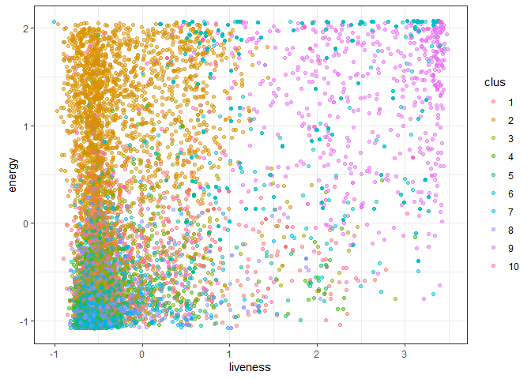
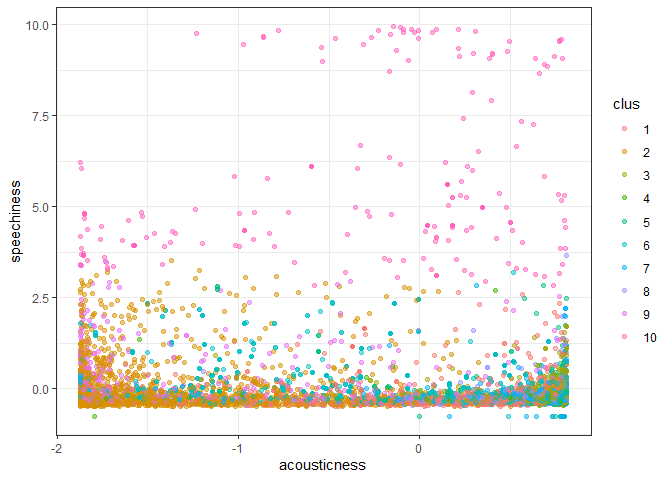
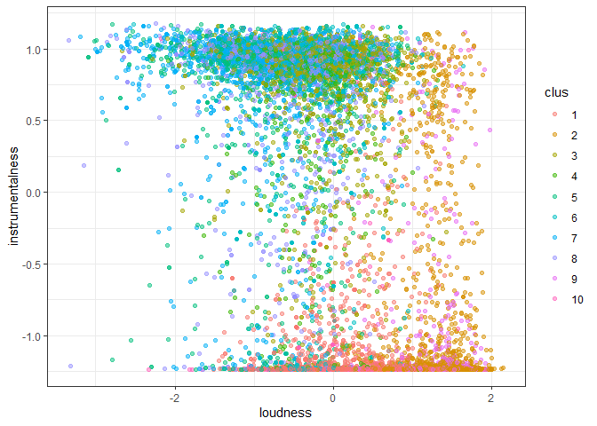
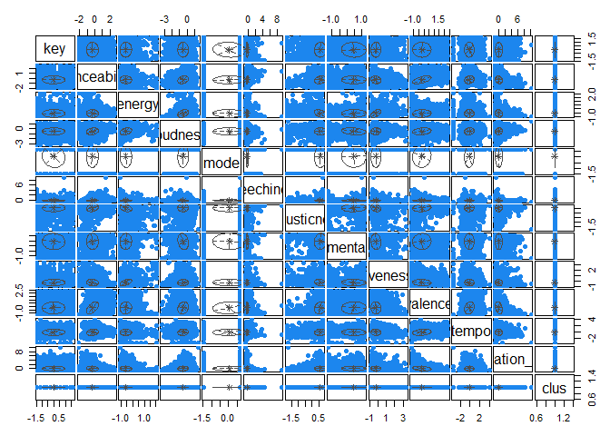
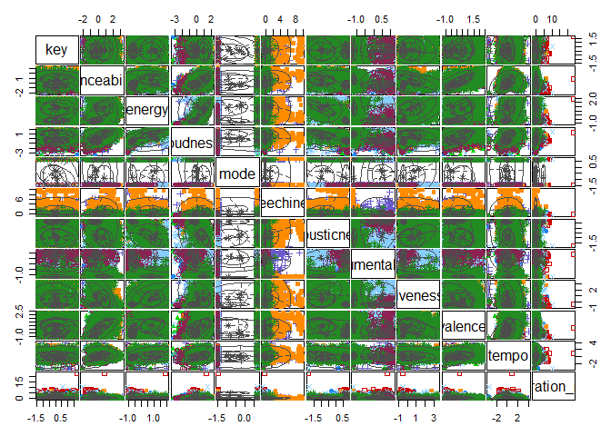
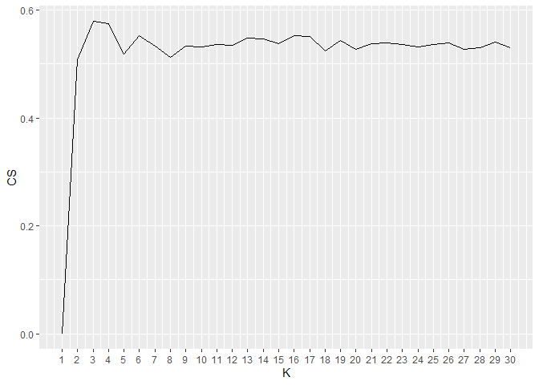
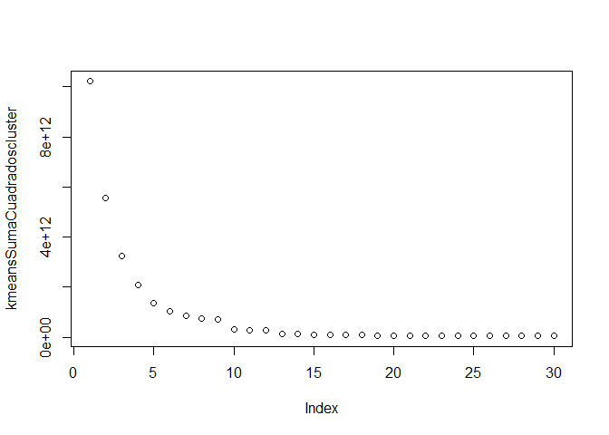

Proyecto 2
================

# Alumnos: Aejandro Manhood y Estivaliz Rosales

Para este proyecto se debe crear una playlist, la cuál debe tener una
duración de 3 horas. La playlist que se creara estará orientada para el
momento en que uno esta haciendo un viaje largo en la carretera, ya sea
en auto o en bus. Por ende, esta playlist será variada, para poder
ayudar en la motivación, pasar un buen rato, para pensar y para que el
usuario pueda cantar si es su deseo.

Para esto se generarán clusters con las canciones de la base de datos;
es importante señalar que se trabajará con una muestra de 10.000
observaciones, esto es debido a que al ser tan grande la base original,
existen complicaciones para algunos computadores al momento de realizar
los diferentes análisis que son necesarios. Es necesario recalcar que
como se trabajará con una muestra de la base original se debe verificar
que esta sea representativa. Para esto se calcularan las medias y
desviaciones estándares, y se busca que las variaciones sean muy
pequeñas. De esta manera se tendrá una muestra representativa de los
datos originales.

Es importante mencionar que se realizará también una limpieza de la
data. Esto con el objetivo de poder retirar tanto elementos que esten
repetidos, como canciones, y también retirar elementos que no hayan sido
consignados. Así podremos reducir el tamaño de nuestra base de datos,
para el momento de generar la muestra.

## Carga de Librerías

Se añaden a nuestro código las librerías a utilizar para los análisis
que realizaremos.

``` r
library(tidyverse)
```

    ## -- Attaching packages --------------------------------------- tidyverse 1.3.0 --

    ## v ggplot2 3.3.3     v purrr   0.3.4
    ## v tibble  3.1.0     v dplyr   1.0.5
    ## v tidyr   1.1.3     v stringr 1.4.0
    ## v readr   1.4.0     v forcats 0.5.1

    ## -- Conflicts ------------------------------------------ tidyverse_conflicts() --
    ## x dplyr::filter() masks stats::filter()
    ## x dplyr::lag()    masks stats::lag()

``` r
library(cluster)
library(factoextra)
```

    ## Welcome! Want to learn more? See two factoextra-related books at https://goo.gl/ve3WBa

``` r
library(janitor)
```

    ## 
    ## Attaching package: 'janitor'

    ## The following objects are masked from 'package:stats':
    ## 
    ##     chisq.test, fisher.test

``` r
library(mclust)
```

    ## Package 'mclust' version 5.4.7
    ## Type 'citation("mclust")' for citing this R package in publications.

    ## 
    ## Attaching package: 'mclust'

    ## The following object is masked from 'package:purrr':
    ## 
    ##     map

``` r
library(utils)
```

## Cargar Datos Actividad

Dado el formato con el que estan subidos los datos, para cargar los
datos se emplea la función load(), y de esta manera tenemos ya listos
neustros datos para comenzar con los análisis pertinentes de esta tarea.

``` r
load("beats.RData")
```

## Preprocesamiento de los datos

### Selección de variables de interés

Una vez cargados los datos, es necesario realizar una limpieza de estos,
para así poder realizar el posterior análisis de mejor manera, y sin
errores en los procesos de clustering debido a datos faltantes por
ejemplo. Y también para poder reducir el tamaño de la base de datos, ya
que se necesita un computador con una gran capacidad de procesamiento
para trabajar con aproximadamente 500.000 datos.

Así, lo primero corresponde a escoger solo aquellas columnas que sean
relevantes para el caso de estudio. En este caso, son aquellas que nos
entregan información respecto de parametros de las canciones, desde que
tan energéticas son, hasta aquelas que si se encuentran siendo grabadas
con público, de esta manera podremos generar clusters y lograr crear la
playlist que es de nuestro interés, que basicamente son todas las
variables que nos entregan información respecto de las canciones, según
la API de spotify, que el profesor nos dió para guiarnos. Estas
variables son:

Danceability

Energy

Key

Loudness

Mode

Speechiness

Acousticness

Instrumentalness

Liveness

Valence

Tempo

Además, se deben conservar las columnas “track\_id” para poder
identificar la canción en spotify, “duration\_ms” para luego determinar
el largo de la playlists a crear y que de esta manera cumpla con el
requisito de duración. Finalmente “track\_name” y “artist\_name”, para
poder entregar una playlist que tenga sentido, ya que es de esperar que
la persona que escuche la playlist desee poder además de saber el nombre
de la canción, quiera conocer al artista para quizás explorar más
respecto de este. Estas columnas serán guardadas en una nueva tabla que
tendra por nombre mus1, luego se muestra un resumen de este y se muestra
el número de filas. Percatandonos que tenemos 447.622 observaciones.

``` r
mus1 <- beats[, c(1,8:19, 23, 27)]
summary(mus1)
```

    ##  artist_name         danceability        energy            key        
    ##  Length:447622      Min.   :0.0000   Min.   :0.0000   Min.   : 0.000  
    ##  Class :character   1st Qu.:0.2520   1st Qu.:0.0756   1st Qu.: 2.000  
    ##  Mode  :character   Median :0.3700   Median :0.2100   Median : 5.000  
    ##                     Mean   :0.3911   Mean   :0.3405   Mean   : 5.061  
    ##                     3rd Qu.:0.5140   3rd Qu.:0.5820   3rd Qu.: 8.000  
    ##                     Max.   :0.9860   Max.   :1.0000   Max.   :11.000  
    ##     loudness            mode         speechiness       acousticness   
    ##  Min.   :-60.000   Min.   :0.0000   Min.   :0.00000   Min.   :0.0000  
    ##  1st Qu.:-24.445   1st Qu.:0.0000   1st Qu.:0.03780   1st Qu.:0.3940  
    ##  Median :-19.477   Median :1.0000   Median :0.04430   Median :0.9230  
    ##  Mean   :-18.672   Mean   :0.6834   Mean   :0.06892   Mean   :0.6987  
    ##  3rd Qu.:-11.644   3rd Qu.:1.0000   3rd Qu.:0.05840   3rd Qu.:0.9860  
    ##  Max.   :  0.496   Max.   :1.0000   Max.   :0.97100   Max.   :0.9960  
    ##  instrumentalness     liveness         valence           tempo       
    ##  Min.   :0.00000   Min.   :0.0000   Min.   :0.0000   Min.   :  0.00  
    ##  1st Qu.:0.00169   1st Qu.:0.0968   1st Qu.:0.0894   1st Qu.: 82.39  
    ##  Median :0.71500   Median :0.1230   Median :0.2740   Median :105.72  
    ##  Mean   :0.50607   Mean   :0.2217   Mean   :0.3374   Mean   :108.74  
    ##  3rd Qu.:0.90100   3rd Qu.:0.2530   3rd Qu.:0.5370   3rd Qu.:131.05  
    ##  Max.   :1.00000   Max.   :1.0000   Max.   :0.9960   Max.   :244.95  
    ##    track_id          duration_ms       track_name       
    ##  Length:447622      Min.   :   1066   Length:447622     
    ##  Class :character   1st Qu.: 123440   Class :character  
    ##  Mode  :character   Median : 194961   Mode  :character  
    ##                     Mean   : 229110                     
    ##                     3rd Qu.: 271560                     
    ##                     Max.   :4796395

``` r
nrow(mus1)
```

    ## [1] 447622

### Limpieza de datos NA

Al hacer el resumen de nuestra tabla filtrada, podemos ver que no
existen datos que sean NA en las variables seleccionadas. Por ende se
prosigue con el analisis para eliminar los elementos que se encuentren
duplicados.

### Limpieza de datos duplicados

En este punto se procede a realizar la eliminación de observaciones que
se encuentren repetidas. Podríamos pensar que con eliminar segun nombre
de la canción nos encontraríamos listos, pero esto sería un error, ya
que pueden existir canciones que tengan el mismo nombre pero sean de
artista diferente. Por ende, la mejor opción es eliminar los “track\_id”
que se encuentren duplicados, ya que como estos son únicos si existe
otra canción que tenga el mismo códgio, quiere decir que se encuentra
duplicada la canción. Para esto se utiliza un chunk que aprendimos en
una ayudantía. Adicionalmente se revisa la cantidad de filas para
comparar cuantas se eliminaron luego del filtrado de duplicados.

Las canciones que son únicas se dejarán en una variable nueva que recibe
el nombre de mus\_uni.

``` r
mus_uni <- mus1[!duplicated(mus1$track_id),]

nrow(mus1) - nrow(mus_uni)
```

    ## [1] 2525

Esto nos da como resultado que fueron eliminadas 2.525 canciones que se
encontraban duplicadas. Luego se procede a revisar si no existe algun
dato que se encuentre omitido Y aquí podemos corroborar que no tenemos
datos NA. Lo cual es bueno porque no nos causará problemas en los
próximos análisis.

``` r
summary(mus_uni)
```

    ##  artist_name         danceability        energy            key        
    ##  Length:445097      Min.   :0.0000   Min.   :0.0000   Min.   : 0.000  
    ##  Class :character   1st Qu.:0.2520   1st Qu.:0.0754   1st Qu.: 2.000  
    ##  Mode  :character   Median :0.3690   Median :0.2090   Median : 5.000  
    ##                     Mean   :0.3907   Mean   :0.3400   Mean   : 5.061  
    ##                     3rd Qu.:0.5130   3rd Qu.:0.5800   3rd Qu.: 8.000  
    ##                     Max.   :0.9860   Max.   :1.0000   Max.   :11.000  
    ##     loudness            mode         speechiness       acousticness   
    ##  Min.   :-60.000   Min.   :0.0000   Min.   :0.00000   Min.   :0.0000  
    ##  1st Qu.:-24.468   1st Qu.:0.0000   1st Qu.:0.03780   1st Qu.:0.3970  
    ##  Median :-19.513   Median :1.0000   Median :0.04430   Median :0.9240  
    ##  Mean   :-18.699   Mean   :0.6836   Mean   :0.06896   Mean   :0.6993  
    ##  3rd Qu.:-11.698   3rd Qu.:1.0000   3rd Qu.:0.05840   3rd Qu.:0.9860  
    ##  Max.   :  0.496   Max.   :1.0000   Max.   :0.97100   Max.   :0.9960  
    ##  instrumentalness     liveness         valence           tempo       
    ##  Min.   :0.00000   Min.   :0.0000   Min.   :0.0000   Min.   :  0.00  
    ##  1st Qu.:0.00177   1st Qu.:0.0968   1st Qu.:0.0889   1st Qu.: 82.35  
    ##  Median :0.71900   Median :0.1230   Median :0.2730   Median :105.71  
    ##  Mean   :0.50728   Mean   :0.2215   Mean   :0.3368   Mean   :108.71  
    ##  3rd Qu.:0.90100   3rd Qu.:0.2520   3rd Qu.:0.5360   3rd Qu.:131.05  
    ##  Max.   :1.00000   Max.   :1.0000   Max.   :0.9960   Max.   :244.95  
    ##    track_id          duration_ms       track_name       
    ##  Length:445097      Min.   :   1066   Length:445097     
    ##  Class :character   1st Qu.: 123036   Class :character  
    ##  Mode  :character   Median : 194613   Mode  :character  
    ##                     Mean   : 228908                     
    ##                     3rd Qu.: 271106                     
    ##                     Max.   :4796395

## Conversión de tipo de datos

Podemos ver en el resumen de mus\_uni, que existen diversos tipos de
datos. Por este motivo procederemos a unficarlos tanto en double (para
los que son numéricos) y character para aquellos que sean palabras, de
esta manera no tendremos inconvenientes por el tipo de dato al realizar
los análisis.

Primero se procedera a convertir las variables numericas a character
para luego pasarlas a double, de esta manera evitaremos cualquier
inconveniente que pudiese surgir producto de esto. (Según lo que se nos
explico en una ayudantía)

``` r
mus_uni$danceability <- as.double(as.character(mus_uni$danceability))
mus_uni$energy <- as.double(as.character(mus_uni$energy))
mus_uni$key <- as.double(as.character(mus_uni$key))
mus_uni$loudness <- as.double(as.character(mus_uni$loudness))
mus_uni$mode <- as.double(as.character(mus_uni$mode))
mus_uni$speechiness <- as.double(as.character(mus_uni$speechiness)) 
mus_uni$acousticness <- as.double(as.character(mus_uni$acousticness))
mus_uni$instrumentalness <- as.double(as.character(mus_uni$instrumentalness))
mus_uni$liveness <- as.double(as.character(mus_uni$liveness))
mus_uni$valence <- as.double(as.character(mus_uni$valence))
mus_uni$tempo <- as.double(as.character(mus_uni$tempo))
mus_uni$duration_ms <- as.double(as.character(mus_uni$duration_ms))
```

Asimismo, realizamos este procedimiento para las varibales que son de
tipo character para volver a convertirlas, en el mismo tipo de dato, que
es character. Y luego se realiza un summary para verificar que no haya
quedado alguna variable NA, luego de realizar las conversiones de tipo
de datos.

``` r
mus_uni$track_id <- as.character(mus_uni$track_id)
mus_uni$track_name <- as.character(mus_uni$track_name)
mus_uni$artist_name <- as.character(mus_uni$artist_name)
summary(mus_uni)
```

    ##  artist_name         danceability        energy            key        
    ##  Length:445097      Min.   :0.0000   Min.   :0.0000   Min.   : 0.000  
    ##  Class :character   1st Qu.:0.2520   1st Qu.:0.0754   1st Qu.: 2.000  
    ##  Mode  :character   Median :0.3690   Median :0.2090   Median : 5.000  
    ##                     Mean   :0.3907   Mean   :0.3400   Mean   : 5.061  
    ##                     3rd Qu.:0.5130   3rd Qu.:0.5800   3rd Qu.: 8.000  
    ##                     Max.   :0.9860   Max.   :1.0000   Max.   :11.000  
    ##     loudness            mode         speechiness       acousticness   
    ##  Min.   :-60.000   Min.   :0.0000   Min.   :0.00000   Min.   :0.0000  
    ##  1st Qu.:-24.468   1st Qu.:0.0000   1st Qu.:0.03780   1st Qu.:0.3970  
    ##  Median :-19.513   Median :1.0000   Median :0.04430   Median :0.9240  
    ##  Mean   :-18.699   Mean   :0.6836   Mean   :0.06896   Mean   :0.6993  
    ##  3rd Qu.:-11.698   3rd Qu.:1.0000   3rd Qu.:0.05840   3rd Qu.:0.9860  
    ##  Max.   :  0.496   Max.   :1.0000   Max.   :0.97100   Max.   :0.9960  
    ##  instrumentalness     liveness         valence           tempo       
    ##  Min.   :0.00000   Min.   :0.0000   Min.   :0.0000   Min.   :  0.00  
    ##  1st Qu.:0.00177   1st Qu.:0.0968   1st Qu.:0.0889   1st Qu.: 82.35  
    ##  Median :0.71900   Median :0.1230   Median :0.2730   Median :105.71  
    ##  Mean   :0.50728   Mean   :0.2215   Mean   :0.3368   Mean   :108.71  
    ##  3rd Qu.:0.90100   3rd Qu.:0.2520   3rd Qu.:0.5360   3rd Qu.:131.05  
    ##  Max.   :1.00000   Max.   :1.0000   Max.   :0.9960   Max.   :244.95  
    ##    track_id          duration_ms       track_name       
    ##  Length:445097      Min.   :   1066   Length:445097     
    ##  Class :character   1st Qu.: 123036   Class :character  
    ##  Mode  :character   Median : 194613   Mode  :character  
    ##                     Mean   : 228908                     
    ##                     3rd Qu.: 271106                     
    ##                     Max.   :4796395

## Muestreo Aleatorio

El siguiente paso es uno sumamente importante, el cual consiste en
generar una muestra aleatoria apartir de la base general de mus\_uni.
Esto se hace debido a que la cantidad de datos es suamamente grande, por
ende, es mejor utilizar una muestra que sea más pequeña, pero que sea
representativa de la base de datos original.

Para esto se calcularan las media y desviaciones estándar de cada
variable y luego se hará lo mismo para la muestra. De esta manera
buscaremos que los valores para las medias y desviaciones, sean lo mas
similares posibles entre las dos muestras.

``` r
set.seed(1000)
mus_muest <- mus_uni[sample(nrow(mus_uni), 10000),]
summary(mus_muest)
```

    ##  artist_name         danceability        energy               key        
    ##  Length:10000       Min.   :0.0000   Min.   :0.0000201   Min.   : 0.000  
    ##  Class :character   1st Qu.:0.2500   1st Qu.:0.0782000   1st Qu.: 2.000  
    ##  Mode  :character   Median :0.3690   Median :0.2125000   Median : 5.000  
    ##                     Mean   :0.3898   Mean   :0.3420743   Mean   : 5.043  
    ##                     3rd Qu.:0.5100   3rd Qu.:0.5870000   3rd Qu.: 8.000  
    ##                     Max.   :0.9760   Max.   :1.0000000   Max.   :11.000  
    ##     loudness            mode         speechiness       acousticness   
    ##  Min.   :-47.432   Min.   :0.0000   Min.   :0.00000   Min.   :0.0000  
    ##  1st Qu.:-24.428   1st Qu.:0.0000   1st Qu.:0.03790   1st Qu.:0.3740  
    ##  Median :-19.438   Median :1.0000   Median :0.04430   Median :0.9215  
    ##  Mean   :-18.676   Mean   :0.6865   Mean   :0.06792   Mean   :0.6949  
    ##  3rd Qu.:-11.707   3rd Qu.:1.0000   3rd Qu.:0.05780   3rd Qu.:0.9860  
    ##  Max.   : -0.203   Max.   :1.0000   Max.   :0.96400   Max.   :0.9960  
    ##  instrumentalness     liveness          valence           tempo       
    ##  Min.   :0.00000   Min.   :0.00000   Min.   :0.0000   Min.   :  0.00  
    ##  1st Qu.:0.00185   1st Qu.:0.09748   1st Qu.:0.0849   1st Qu.: 82.71  
    ##  Median :0.73500   Median :0.12200   Median :0.2640   Median :106.03  
    ##  Mean   :0.51158   Mean   :0.22358   Mean   :0.3346   Mean   :109.13  
    ##  3rd Qu.:0.90100   3rd Qu.:0.25400   3rd Qu.:0.5340   3rd Qu.:131.08  
    ##  Max.   :0.99900   Max.   :0.99600   Max.   :0.9860   Max.   :235.50  
    ##    track_id          duration_ms       track_name       
    ##  Length:10000       Min.   :   6466   Length:10000      
    ##  Class :character   1st Qu.: 123426   Class :character  
    ##  Mode  :character   Median : 195780   Mode  :character  
    ##                     Mean   : 230280                     
    ##                     3rd Qu.: 272253                     
    ##                     Max.   :4436626

A continuación se procede a calcular los valores de las medias y
desviaciones estandares, tanto para la base de datos original, como para
la muestra. De esta manera podremos saber si el tamaño es correcto para
nuestro análisis.

``` r
mus_num <- mus_uni %>% 
  select(c("danceability", "energy", "key", "loudness", "mode", "speechiness", "acousticness", "instrumentalness", "liveness", "valence", "tempo"))
"Media Base Original"
```

    ## [1] "Media Base Original"

``` r
apply(mus_num, 2,mean)
```

    ##     danceability           energy              key         loudness 
    ##       0.39066947       0.33995142       5.06142257     -18.69851501 
    ##             mode      speechiness     acousticness instrumentalness 
    ##       0.68363301       0.06896123       0.69934855       0.50728055 
    ##         liveness          valence            tempo 
    ##       0.22152894       0.33684687     108.71151886

``` r
"Desviación Estándar Base Original"
```

    ## [1] "Desviación Estándar Base Original"

``` r
apply(mus_num, 2, sd)
```

    ##     danceability           energy              key         loudness 
    ##       0.18326700       0.31758722       3.49174478       8.63546733 
    ##             mode      speechiness     acousticness instrumentalness 
    ##       0.46505850       0.09430089       0.36938176       0.41351487 
    ##         liveness          valence            tempo 
    ##       0.21915679       0.27415513      31.64678677

Ahora vienen la media y desviación estándar de la muestra.

``` r
mus_num2 <- mus_muest %>% 
  select(c("danceability", "energy", "key", "loudness", "mode", "speechiness", "acousticness", "instrumentalness", "liveness", "valence", "tempo"))
"Media Base Original"
```

    ## [1] "Media Base Original"

``` r
apply(mus_num2, 2,mean)
```

    ##     danceability           energy              key         loudness 
    ##       0.38980887       0.34207426       5.04340000     -18.67581480 
    ##             mode      speechiness     acousticness instrumentalness 
    ##       0.68650000       0.06791765       0.69491758       0.51158278 
    ##         liveness          valence            tempo 
    ##       0.22358269       0.33455767     109.13311040

``` r
"Desviación Estándar Base Original"
```

    ## [1] "Desviación Estándar Base Original"

``` r
apply(mus_num2, 2, sd)
```

    ##     danceability           energy              key         loudness 
    ##       0.18278349       0.31766997       3.50324760       8.62198215 
    ##             mode      speechiness     acousticness instrumentalness 
    ##       0.46393887       0.09007888       0.37170067       0.41451291 
    ##         liveness          valence            tempo 
    ##       0.22173434       0.27504460      31.56264733

Luego por medio de inspección visual podemos apreciar que la muestra es
representativa, ya que las variaciones existentes entre las medias y
desviaciones estándares, son mínimas. Por ende procederemos a realizar
los cálculos con la muestra creada.

## Escalamiento de los Datos

Luego en este punto se procede a escalar la data. El sentido de esto es
poder trabajar en medidas que sean mas pequeñas y que por ende, permitan
que los analisis sean mas sencillos. Es por esto que lo primero que se
debe hacer es separar las variables que sean numericas de las
caracteres, en la base de datos de la muestra.

``` r
songs_char <- mus_muest %>% 
  select(c("artist_name", "track_id", "track_name"))
songs_num <- mus_muest %>%
  select(c("key", "danceability", "energy", "loudness", "mode", "speechiness", "acousticness", "instrumentalness", "liveness", "valence", "tempo", "duration_ms"))
```

Luego, se procede a realizar el escalado de la data para los posteriores
analisis de clusters. Esto es el escalamiento de las variables
numericas, evidentemente.

``` r
mus_scale <- data.frame(sapply(songs_num, scale))
```

A continuación se procede a revisar que la data escalada no tenga
valores que sean NA, ya que como se hizo este proceso quizás algún dato
fue emitido. Seria extraño, pero no esta nunca de más revisar. En caso
de existir, estos son retirados.

``` r
summary(mus_scale)
```

    ##       key            danceability         energy           loudness      
    ##  Min.   :-1.43964   Min.   :-2.1326   Min.   :-1.0768   Min.   :-3.3352  
    ##  1st Qu.:-0.86874   1st Qu.:-0.7649   1st Qu.:-0.8307   1st Qu.:-0.6672  
    ##  Median :-0.01239   Median :-0.1138   Median :-0.4079   Median :-0.0884  
    ##  Mean   : 0.00000   Mean   : 0.0000   Mean   : 0.0000   Mean   : 0.0000  
    ##  3rd Qu.: 0.84396   3rd Qu.: 0.6576   3rd Qu.: 0.7710   3rd Qu.: 0.8082  
    ##  Max.   : 1.70031   Max.   : 3.2070   Max.   : 2.0711   Max.   : 2.1425  
    ##       mode          speechiness       acousticness     instrumentalness 
    ##  Min.   :-1.4797   Min.   :-0.7540   Min.   :-1.8696   Min.   :-1.2342  
    ##  1st Qu.:-1.4797   1st Qu.:-0.3332   1st Qu.:-0.8634   1st Qu.:-1.2297  
    ##  Median : 0.6757   Median :-0.2622   Median : 0.6096   Median : 0.5390  
    ##  Mean   : 0.0000   Mean   : 0.0000   Mean   : 0.0000   Mean   : 0.0000  
    ##  3rd Qu.: 0.6757   3rd Qu.:-0.1123   3rd Qu.: 0.7831   3rd Qu.: 0.9395  
    ##  Max.   : 0.6757   Max.   : 9.9478   Max.   : 0.8100   Max.   : 1.1759  
    ##     liveness          valence            tempo           duration_ms     
    ##  Min.   :-1.0083   Min.   :-1.2164   Min.   :-3.45767   Min.   :-1.2566  
    ##  1st Qu.:-0.5687   1st Qu.:-0.9077   1st Qu.:-0.83710   1st Qu.:-0.5999  
    ##  Median :-0.4581   Median :-0.2565   Median :-0.09832   Median :-0.1937  
    ##  Mean   : 0.0000   Mean   : 0.0000   Mean   : 0.00000   Mean   : 0.0000  
    ##  3rd Qu.: 0.1372   3rd Qu.: 0.7251   3rd Qu.: 0.69522   3rd Qu.: 0.2356  
    ##  Max.   : 3.4835   Max.   : 2.3685   Max.   : 4.00362   Max.   :23.6156

Se aprecia que no existen datos NA, por ende se prosigue con el analisis
por medio de clusters.

# Procesamiento de los Datos

## Análisis de Clusters

### Kmeans

Como ya tenemos nuestra data muestral, escalada y sin presencia de datos
NA, podemos comenzar con el proceso de análisis de clusters.
Comenzaremos con K means, buscando que hayan 10 clusters, para luego ir
variando estos resultados acorde a lo que se vaya descubriendo. En este
paso se clona la variable de la dara escalada, para que no modifique a
la original, y de esta manera si en el futuro necesitamos usar la
original, no tengamos algun inconveniente. Por eso, se crea la variable
mus\_scale10.

``` r
kmeans10 <- kmeans(mus_scale, centers = 10)
mus_scale10 <- mus_scale
mus_scale10$clus <- kmeans10$cluster %>% as.factor()
ggplot(mus_scale10, aes(liveness, energy, color=clus)) +
  geom_point(alpha=0.5, show.legend = T) +
  theme_bw()
```

<!-- -->

``` r
ggplot(mus_scale10, aes(acousticness, speechiness, color=clus)) +
  geom_point(alpha=0.5, show.legend = T) +
  theme_bw()
```

<!-- -->

``` r
ggplot(mus_scale10, aes(loudness, instrumentalness, color=clus)) +
  geom_point(alpha=0.5, show.legend = T) +
  theme_bw()
```

<!-- -->

Podemos ver por medio de inspección visual que este valor para K no es
ideal, ya que los clusters estan sumamente desordenados. Además debemos
cambiar este valor, porque nosotros queremos clusters en donde existan
canciones similares, y podemos apreciar a simple vista que todo esta muy
mezclado. Por ende, procedemos a realizar el calculo del coeficiente de
silueta, para de esta manera lograr encontrar el valor ideal que debiese
tener K.

### Coeficiente de Silueta

``` r
coefSil=numeric(30)
for (k in 2:30){
  modelo <- kmeans(mus_scale, centers = k)
  temp <- silhouette(modelo$cluster,dist(mus_scale))
  coefSil[k] <- mean(temp[,3])
}
tempDF=data.frame(CS=coefSil,K=c(1:30))
ggplot(tempDF, aes(x=K, y=CS)) + 
  geom_line() +
  scale_x_continuous(breaks=c(1:30))
```

<!-- -->

De este modelo podemos ver el valor de K ideal sería de 2, pero esto
seria erróneo y contraproducente hacerlo, ya que si para el valor de 10,
los datos estaban desordenados, para el valor de 2 será aún mayor el
desorden, ya que los datos estarían en dos clusters. Se procede a
mostrar esto gráficamente. Para un valor de K=2.

Finalmente, se toma como una idea, el intentar aplicar metodos de
clusterización sobre el primer cluster generado al utilizar k = 2. En
este paso se clona la variable de la data escalada, para que no
modifique a la original, y de esta manera si en el futuro necesitamos
usar la original, no tengamos algun inconveniente. Por eso, se crea la
variable mus\_scale2.

``` r
kmeans2 = kmeans(mus_scale, centers = 2)
mus_scale2 <- mus_scale
mus_scale2$clus <- kmeans2$cluster %>% as.factor()
ggplot(mus_scale2, aes(liveness, energy, color=clus)) +
  geom_point(alpha=0.5, show.legend = T) +
  theme_bw()
```

<!-- -->

``` r
ggplot(mus_scale2, aes(acousticness, speechiness, color=clus)) +
  geom_point(alpha=0.5, show.legend = T) +
  theme_bw()
```

<!-- -->

``` r
ggplot(mus_scale2, aes(loudness, instrumentalness, color=clus)) +
  geom_point(alpha=0.5, show.legend = T) +
  theme_bw()
```

<!-- -->

Al observar esto, se procede a analizar los datos pertenecientes al
primer cluster generado por el modelo al usar un k = 2. Esto será por
medio de cluster probabilístocs, ya que de esta manera quizás se logre
un mejor resultado.

``` r
clu1_k2 <- mus_scale2 %>% filter(mus_scale2$clus == 1)
summary(clu1_k2)
```

    ##       key            danceability         energy           loudness       
    ##  Min.   :-1.43964   Min.   :-2.1326   Min.   :-1.0768   Min.   :-3.33522  
    ##  1st Qu.:-0.86874   1st Qu.:-0.9235   1st Qu.:-0.9383   1st Qu.:-0.96459  
    ##  Median :-0.01239   Median :-0.3819   Median :-0.7368   Median :-0.44482  
    ##  Mean   :-0.01172   Mean   :-0.3306   Mean   :-0.6030   Mean   :-0.52810  
    ##  3rd Qu.: 0.84396   3rd Qu.: 0.1652   3rd Qu.:-0.4409   3rd Qu.:-0.03354  
    ##  Max.   : 1.70031   Max.   : 2.6545   Max.   : 2.0680   Max.   : 1.48931  
    ##       mode           speechiness       acousticness     instrumentalness 
    ##  Min.   :-1.47972   Min.   :-0.7540   Min.   :-1.8696   Min.   :-1.2342  
    ##  1st Qu.:-1.47972   1st Qu.:-0.3288   1st Qu.: 0.6351   1st Qu.: 0.2398  
    ##  Median : 0.67574   Median :-0.2766   Median : 0.7616   Median : 0.8791  
    ##  Mean   : 0.04736   Mean   :-0.2161   Mean   : 0.6022   Mean   : 0.4492  
    ##  3rd Qu.: 0.67574   3rd Qu.:-0.1950   3rd Qu.: 0.7966   3rd Qu.: 0.9805  
    ##  Max.   : 0.67574   Max.   : 9.0818   Max.   : 0.8100   Max.   : 1.1759  
    ##     liveness          valence            tempo          duration_ms       
    ##  Min.   :-1.0083   Min.   :-1.2164   Min.   :-3.4577   Min.   :-1.256550  
    ##  1st Qu.:-0.5849   1st Qu.:-0.9602   1st Qu.:-0.9528   1st Qu.:-0.692650  
    ##  Median :-0.5032   Median :-0.5110   Median :-0.3679   Median :-0.321583  
    ##  Mean   :-0.2978   Mean   :-0.2043   Mean   :-0.1660   Mean   : 0.003178  
    ##  3rd Qu.:-0.3183   3rd Qu.: 0.2961   3rd Qu.: 0.5802   3rd Qu.: 0.252717  
    ##  Max.   : 3.4023   Max.   : 2.3685   Max.   : 4.0036   Max.   :10.276360  
    ##  clus    
    ##  1:6363  
    ##  2:   0  
    ##          
    ##          
    ##          
    ## 

### Cluster Probabilístico

Dados los problemas presentados al intentar encontrar un valor para K
ideal, se procede a analizar por medio de cluster probabilísticos al
primer cluster que se genero al usar el valor de k = 2. Ya que de esta
manera podremos lograr encontrar cluster que sigan una distribución
prababilistica.

Para esto el modelo intenta optimizar los valores de mu y k, para las
conformación de estos clusters. (Según lo visto en clases) Además, este
se realizará sobre el primer cluster de K=2.

Para esto se utilizará el modelo de kmeans GMM (Gaussiano Multivariado),
ya que tiene un parecido con el kmeans.

``` r
kmeansGMM <- Mclust(clu1_k2)
plot(kmeansGMM, what = 'classification')
```

<!-- -->

``` r
summary(kmeansGMM)
```

    ## ---------------------------------------------------- 
    ## Gaussian finite mixture model fitted by EM algorithm 
    ## ---------------------------------------------------- 
    ## 
    ## Mclust XXX (ellipsoidal multivariate normal) model with 1 component: 
    ## 
    ##  log-likelihood    n  df      BIC      ICL
    ##        105025.7 6363 104 209140.5 209140.5
    ## 
    ## Clustering table:
    ##    1 
    ## 6363

Al realizar la funcion summary sobre nuestra variable que contiene
kmeansGMM, podemos apreciar que lamentablemente no se logra obtener
información adicional, respecto de que valor sería el ideal para k, y de
esta manera generar los clusters necesarios.

## Proceso Invertido de Clusterización

Una manera que se puede intentar para obtener el numero ideal de k, es
por medio de empezar realizando primero cluster probabilisticos, y luego
cuando se tenga esta distribución se procede a ralizar kmeans. De esta
manera se podría tener quizás un mayor orden, y de esta manera
determinar cual es el k ideal para poder generar los clusters.

El primer paso consiste en generar el grafico de acuerdo al modelo GMM
para la data numerica que se encuentra escalada, de esta manera
intentaremos identificar si es que surge algun posible valolr para K.

``` r
gmm <- Mclust(mus_scale)
plot(gmm, what = 'classification')
```

<!-- -->

``` r
summary(gmm)
```

    ## ---------------------------------------------------- 
    ## Gaussian finite mixture model fitted by EM algorithm 
    ## ---------------------------------------------------- 
    ## 
    ## Mclust VEV (ellipsoidal, equal shape) model with 8 components: 
    ## 
    ##  log-likelihood     n  df       BIC       ICL
    ##       -89993.03 10000 650 -185972.8 -186687.4
    ## 
    ## Clustering table:
    ##    1    2    3    4    5    6    7    8 
    ## 1710  120 2275  511 1106  888 1609 1781

Este gráfico si permite diferenciar a una escala muy baja que existe una
cierta tendencia de clusters, pero desafortunadamente aún no es posible
distinguir algún valor para poder asignarle a k, ya que al aplicar la
función de resumen, no es posible aún identificar este valor que nos
encontramos buscando. Se aprecia que el modelo indica que los clusters a
generar debiesen ser 8. Esto se tendrá en consideración para la elección
del k final

Lo siguiente que se debe hacer es juntar la muestra aleatoria de los
datos junto con el cluster al que esta asignado cada canción, para de
esta manera poder identificar a cada una.

``` r
mus_muest_clu <- NULL
cl <- gmm$classification
mus_muest_clu <- cbind(mus_muest, cl)
```

A continuación, se procede con elegir la canción de interés,la cual es
una de Yandel, que se llama Explicale.

``` r
cancion <- mus_muest_clu[123,]
summary(cancion)
```

    ##  artist_name         danceability       energy          key       loudness     
    ##  Length:1           Min.   :0.808   Min.   :0.69   Min.   :1   Min.   :-4.151  
    ##  Class :character   1st Qu.:0.808   1st Qu.:0.69   1st Qu.:1   1st Qu.:-4.151  
    ##  Mode  :character   Median :0.808   Median :0.69   Median :1   Median :-4.151  
    ##                     Mean   :0.808   Mean   :0.69   Mean   :1   Mean   :-4.151  
    ##                     3rd Qu.:0.808   3rd Qu.:0.69   3rd Qu.:1   3rd Qu.:-4.151  
    ##                     Max.   :0.808   Max.   :0.69   Max.   :1   Max.   :-4.151  
    ##       mode    speechiness     acousticness    instrumentalness    liveness    
    ##  Min.   :1   Min.   :0.148   Min.   :0.0583   Min.   :0        Min.   :0.103  
    ##  1st Qu.:1   1st Qu.:0.148   1st Qu.:0.0583   1st Qu.:0        1st Qu.:0.103  
    ##  Median :1   Median :0.148   Median :0.0583   Median :0        Median :0.103  
    ##  Mean   :1   Mean   :0.148   Mean   :0.0583   Mean   :0        Mean   :0.103  
    ##  3rd Qu.:1   3rd Qu.:0.148   3rd Qu.:0.0583   3rd Qu.:0        3rd Qu.:0.103  
    ##  Max.   :1   Max.   :0.148   Max.   :0.0583   Max.   :0        Max.   :0.103  
    ##     valence         tempo         track_id          duration_ms    
    ##  Min.   :0.64   Min.   :125.1   Length:1           Min.   :223146  
    ##  1st Qu.:0.64   1st Qu.:125.1   Class :character   1st Qu.:223146  
    ##  Median :0.64   Median :125.1   Mode  :character   Median :223146  
    ##  Mean   :0.64   Mean   :125.1                      Mean   :223146  
    ##  3rd Qu.:0.64   3rd Qu.:125.1                      3rd Qu.:223146  
    ##  Max.   :0.64   Max.   :125.1                      Max.   :223146  
    ##   track_name              cl   
    ##  Length:1           Min.   :5  
    ##  Class :character   1st Qu.:5  
    ##  Mode  :character   Median :5  
    ##                     Mean   :5  
    ##                     3rd Qu.:5  
    ##                     Max.   :5

Aqui procedemos a identifcar en que cluster se encuentra esta canción. Y
podemos ver que esta en el cluster número 5

``` r
cluster <- mus_muest_clu %>% filter(mus_muest_clu$cl == cancion$cl)
summary(cluster)
```

    ##  artist_name         danceability        energy              key        
    ##  Length:1106        Min.   :0.1180   Min.   :0.000992   Min.   : 0.000  
    ##  Class :character   1st Qu.:0.3870   1st Qu.:0.446000   1st Qu.: 2.000  
    ##  Mode  :character   Median :0.5670   Median :0.656000   Median : 6.000  
    ##                     Mean   :0.5388   Mean   :0.619382   Mean   : 5.665  
    ##                     3rd Qu.:0.6880   3rd Qu.:0.833750   3rd Qu.: 9.000  
    ##                     Max.   :0.9480   Max.   :0.993000   Max.   :11.000  
    ##     loudness            mode         speechiness       acousticness      
    ##  Min.   :-34.328   Min.   :0.0000   Min.   :0.02340   Min.   :0.0000047  
    ##  1st Qu.:-14.338   1st Qu.:0.0000   1st Qu.:0.04553   1st Qu.:0.0358250  
    ##  Median : -7.853   Median :0.0000   Median :0.09460   Median :0.2170000  
    ##  Mean   :-10.706   Mean   :0.2595   Mean   :0.17512   Mean   :0.3105522  
    ##  3rd Qu.: -5.444   3rd Qu.:1.0000   3rd Qu.:0.21600   3rd Qu.:0.5570000  
    ##  Max.   : -0.203   Max.   :1.0000   Max.   :0.96400   Max.   :0.9950000  
    ##  instrumentalness       liveness          valence           tempo       
    ##  Min.   :0.0000000   Min.   :0.00857   Min.   :0.0154   Min.   : 48.13  
    ##  1st Qu.:0.0000000   1st Qu.:0.11100   1st Qu.:0.2360   1st Qu.: 91.99  
    ##  Median :0.0000188   Median :0.23500   Median :0.4625   Median :113.16  
    ##  Mean   :0.0038761   Mean   :0.33031   Mean   :0.4670   Mean   :116.48  
    ##  3rd Qu.:0.0013975   3rd Qu.:0.46500   3rd Qu.:0.6847   3rd Qu.:136.69  
    ##  Max.   :0.1480000   Max.   :0.98900   Max.   :0.9720   Max.   :208.33  
    ##    track_id          duration_ms       track_name              cl   
    ##  Length:1106        Min.   :  18706   Length:1106        Min.   :5  
    ##  Class :character   1st Qu.: 180163   Class :character   1st Qu.:5  
    ##  Mode  :character   Median : 216267   Mode  :character   Median :5  
    ##                     Mean   : 219560                      Mean   :5  
    ##                     3rd Qu.: 263593                      3rd Qu.:5  
    ##                     Max.   :1401364                      Max.   :5

A continuación, se procede a calcular el valor del coeficiente de
siluerta para estos clusters. Y podemos ver de manera gráfica que el k
que quizás podría servir es igual a 5.

``` r
clu_num <- cluster %>% select(c("key", "danceability", "energy", "loudness", "mode", "speechiness", "acousticness", "instrumentalness", "liveness", "valence", "tempo", "duration_ms"))
coefSil=numeric(30)
for (k in 2:30){
  modelo <- kmeans(clu_num, centers = k)
  temp <- silhouette(modelo$cluster,dist(clu_num))
  coefSil[k] <- mean(temp[,3])
}
tempDF=data.frame(CS=coefSil,K=c(1:30))
ggplot(tempDF, aes(x=K, y=CS)) + 
  geom_line() +
  scale_x_continuous(breaks=c(1:30))
```

<!-- -->

Luego de lo anterior, se realiza el grafico del codo, para poder
visualizar y validar en que punto se debería fijar el k. Para esto se
observo en que lugar se produce el quiebre. El cual de manera visual se
ve que es en el 5.

``` r
kmeansSumaCuadradoscluster <- numeric(30)
for(k in 1:30){
  modelo <- kmeans(clu_num, centers = k)
  kmeansSumaCuadradoscluster[k] <- modelo$tot.withinss
}
plot(kmeansSumaCuadradoscluster)
```

<!-- -->

De esta manera se reafirma la posición de realizar el análisis de
kmeans, con un k = 5. Para la canción que se escogió más arriba. Por
esto se hace el modelo, y despues se esto se procede con el momento de
filtrar las canciones acorde a su cluster.

``` r
modeloKmeansCluster <- kmeans(clu_num, centers = 5)
cluster$cl <- NULL
cluster$cl<- modeloKmeansCluster$cluster
cancion2 <- cluster %>% filter(cluster$track_id == cancion$track_id)
k_cluf <- cluster %>% filter(cluster$cl == cancion2$cl)
```

Es importante señalar que un requisito de este trabajo es que la
playlist tenga una duración de 3 horas. Por ende, se tomo la decisión de
no transformar el tiempo a minutos, y por ende, se trabajará unicamente
en milisegundos. Para esto debemos recordar que 1 minuto equivale a
60.000 milisegundos. Por ende al momento de calcular la duración de la
playlist, nos preocuparemos que el tiempo de esta sea menor o igual a
10.800.000 milisegundos.

Para esto lo que se realiza, es agregar la cancion que tenemos como
referencia a nuestra playlist, además de su duración. De esta manera
programamos un contador que empiece en la duración de la cancion que
escogimos. Luego por medio de un ciclo while se procede a agregar
canciones de manera random a la playlist. En caso que esta ya esta
agregada no se agregara denuevo, esto por medio de un condicional if.

Luego se unen las diferentes filas de esta playlist, para luego ser
presentadas al usuario interesado.

``` r
cancion2 <- cluster %>% filter(cluster$track_id == cancion$track_id)
Playlist <- NULL
c_time <- cancion2$duration_ms
tiempoMax <- 10800000
Playlist <- rbind.data.frame(Playlist, cancion)
while (c_time <= tiempoMax) {
  
  cancionElegida <- k_cluf[sample(nrow(k_cluf), 1),]
  
  if(any(Playlist$track_id == cancionElegida$track_id)){
    next
  }
  
  Playlist <- rbind.data.frame(Playlist, cancionElegida)
  
  c_time = c_time + as.numeric(cancionElegida$duration_ms) 
}
```

## Resultado

Finalmente el último paso, es mostrar las canciones para el usuario. Es
importante señalar que para que sea amigable, se mostraran los nombres
de las canciones y su artista.

``` r
PlaylistPrint <- Playlist %>% select(c("track_name", "artist_name"))
head(as.matrix.data.frame(PlaylistPrint), nrow(PlaylistPrint))
```

    ##        track_name                                                             
    ## 445906 "Explícale (feat. Bad Bunny)"                                          
    ## 329    "Get It Started (feat. Shakira)"                                       
    ## 237    "Orishas Llego (Cayo Huesco Remix)"                                    
    ## 289    "Me & U"                                                               
    ## 151    "Summerboy"                                                            
    ## 285    "Dulce Memoria"                                                        
    ## 252    "Zen Habitat"                                                          
    ## 170    "My Toy Soldier"                                                       
    ## 302    "Cae de Una - Headphone Mix"                                           
    ## 198    "Love In The Dark"                                                     
    ## 2      "Nada para Ver - En Vivo"                                              
    ## 286    "Besos Mojados - Live At Coliseo Jose Miguel Agrelot, Puerto Rico/2010"
    ## 354    "Irregular Heartbeat"                                                  
    ## 91     "Creo Que (feat. Asan)"                                                
    ## 267    "Nunca Me Amaron Así"                                                  
    ## 128    "Play for Today - 2006 Remaster"                                       
    ## 232    "Serpiente De Gas"                                                     
    ## 318    "La niña (feat. Plan B)"                                               
    ## 107    "Viva La Vida"                                                         
    ## 133    "Runaway (feat. Candace Sosa)"                                         
    ## 297    "Eleva Eleguá"                                                         
    ## 26     "Go Now - Live / Remastered"                                           
    ## 106    "Make The Money"                                                       
    ## 342    "Prenderemos Fuego al Cielo"                                           
    ## 28     "Like An Animal"                                                       
    ## 111    "Encapsulating Eternity"                                               
    ## 350    "Moondance"                                                            
    ## 310    "Die Entführung aus dem Serail, K.384 - Act 2: \"Frisch zum Kampfe\""  
    ## 10     "Medicine Ball - Album Version (Edited)"                               
    ## 280    "Love Hurts - Live at HQ, Los Angeles, CA - June/July 2011"            
    ## 66     "Ebrio De Sinrazón"                                                    
    ## 313    "Fly To My Room"                                                       
    ## 52     "Encapsulating Eternity"                                               
    ## 269    "Overjoyed"                                                            
    ## 56     "Rock That Body"                                                       
    ## 260    "Plc.4 Mie Hæd (Amp Live Reanimation) [feat. Zion]"                    
    ## 270    "Way Back"                                                             
    ## 294    "Can't Have Everything"                                                
    ## 384    "Clear Skies"                                                          
    ## 223    "Until The End Of Time - Album Version (Edit)"                         
    ## 299    "Locura y pasión"                                                      
    ## 202    "Nunca"                                                                
    ## 341    "Low Income (feat. Beast & 718 Crew)"                                  
    ## 57     "Feliz por um triz"                                                    
    ##        artist_name              
    ## 445906 "Yandel"                 
    ## 329    "Pitbull"                
    ## 237    "Orishas"                
    ## 289    "Flo Rida"               
    ## 151    "Lady Gaga"              
    ## 285    "Ismael Serrano"         
    ## 252    "Mother Nature Sound FX" 
    ## 170    "50 Cent"                
    ## 302    "Ricky Martin"           
    ## 198    "Adele"                  
    ## 2      "No Te Va Gustar"        
    ## 286    "Wisin & Yandel"         
    ## 354    "50 Cent"                
    ## 91     "KHEA"                   
    ## 267    "Camilo Sesto"           
    ## 128    "The Cure"               
    ## 232    "Fito Paez"              
    ## 318    "Zion & Lennox"          
    ## 107    "Coldplay"               
    ## 133    "Armin van Buuren"       
    ## 297    "Timbalada"              
    ## 26     "Paul McCartney"         
    ## 106    "Macklemore & Ryan Lewis"
    ## 342    "Francisca Valenzuela"   
    ## 28     "RÜFÜS DU SOL"           
    ## 111    "Mother Nature Sound FX" 
    ## 350    "Nana Mouskouri"         
    ## 310    "Wolfgang Amadeus Mozart"
    ## 10     "Eminem"                 
    ## 280    "Incubus"                
    ## 66     "Bersuit Vergarabat"     
    ## 313    "BTS"                    
    ## 52     "Mother Nature Sound FX" 
    ## 269    "Bahamas"                
    ## 56     "Black Eyed Peas"        
    ## 260    "Linkin Park"            
    ## 270    "TLC"                    
    ## 294    "Drake"                  
    ## 384    "Keane"                  
    ## 223    "2Pac"                   
    ## 299    "Santaferia"             
    ## 202    "Anuel AA"               
    ## 341    "Wyclef Jean"            
    ## 57     "Gilberto Gil"

``` r
print(c_time)
```

    ## [1] 10818709

Adicionalmente, se imprime la duracion de esta excede en una muy pequeña
parte, de hecho para ser exactos en 18 segundos. Por ende, concluimos
queeste es un resultado aceptable.

De esta manera obtenemos la playlist asociada a nuestro proyecto.
